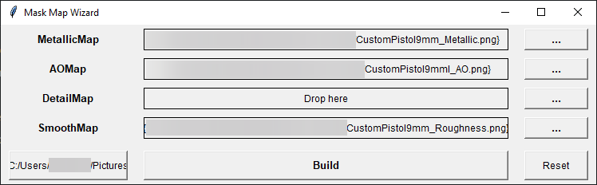

# MaskMapWizard

This is a simple Python app, designed to help you create Mask Maps by combining multiple textures (such as Metallic, AO, Detail, and Smoothness) into a single RGBA image. It’s a powerful solution for optimizing textures in Unity HDRP, where these maps are commonly used to improve material performance.

[**Download the latest version here**](https://github.com/cfrBernard/MaskMapWizard/releases)


## Features:
- Drag and drop support for texture files – (Metallic, AO, Detail, Smoothness).
- Automatically resizes and merges the maps into a single RGBA image.
- Supports Unity HDRP conventions – (Metallic in Red, AO in Green, Detail in Blue, and Smoothness in Alpha).
- Supports inversion of Roughness maps to Smoothness – (HDRP needs it).
- Missing channels are automatically filled with black (0) – avoiding broken maps or crashes.
- Path selection for output files.

---

<p align="center">
  
</p>

---

## 🛠 Development Setup

### Requirements:
- Python 3.11+
- Pillow for image processing
- tkinterdnd2-universal for drag and drop
- tkinter for the GUI

### Installation (Dev Mode):

```
git clone https://github.com/cfrBernard/MaskMapWizard.git
cd MaskMapWizard
```
```
pip install -e .
# or
pip install -e .[dev]
```

> **Note**: Using a .venv is highly recommended.

---

## Dev Tools

### Run the App:

```
python -m MaskMapWizard
```

### Build the App:

```
python build.py
```

### Run pre-commit hooks:

```
pre-commit run --all-files
```

---

## How to Use:

- Drag and Drop the Metallic, AO, Detail, and Smoothness textures into their respective fields. (If you don’t have a texture for one of the channels, leave it empty)
- Select the Export Path where you want the final Mask Map to be saved.
- Hit Build to create your combined Mask Map.
- Check the Console for messages and updates.

---

## 🔮 What's Coming:

- **Support for other engines:** Introducing presets for different game engines like Unreal Engine (ORM), with configurable channel order.
- **Customizable Mask Map settings:** Ability to invert Smoothness to Roughness, select channel order, and tweak other settings for flexibility.
- **Advanced Mapping Options:** Define exactly which maps go into which RGBA channels.
- **Improved UI:** A more polished user interface with intuitive features and better error handling.

## Notes:
- This tool is currently Unity HDRP-focused, but it will evolve to support more engines.
- Feel free to contribute by adding engine-specific presets, new features, or bug fixes!
- For additional tips and troubleshooting, refer to the [tips & troubleshooting](docs/tips_troubleshooting.md) section.
- For more information about the version, please refer to the [changelog](docs/CHANGELOG.md) section.
- This project is licensed under the MIT License. See the [LICENSE](./LICENSE.md) file for details.
- For additional build informations, refer to the [build_instructions](docs/build_instructions.md) file.

## 🤝 Contact:
For issues, suggestions, or contributions, feel free to open an issue on the GitHub repository.
